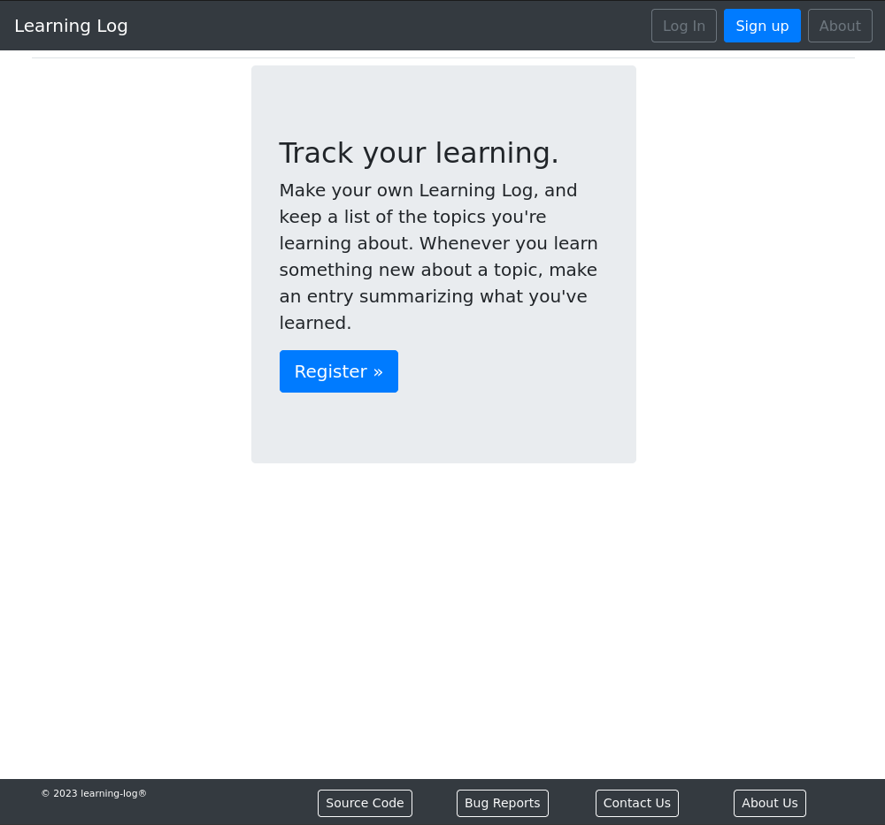

## Learning Log

  
  
  
  

Learning Log is an online journal system that lets you keep track of information you’ve learned about particular topics. Learning log is built using the Django 5.2.x web framework.

It allows users to log the topics they’re interested in and to make journal entries as
they learn about each topic. Once logged in, a user can create new topics, add new entries, and read and edit existing entries.

### Table of Contents

- [Features](#features)
- [Installation](#installation)
- [Testing](#testing)
- [Application Demo](#application-demo)
- [Screenshots](#screenshots)
- [Reporting Bugs](#reporting-bugs)

---

### Features

- Application
    - Create & edit new topics and entries
    - User registration with email verification & social(GitHub) login using [django-allauth](https://pypi.org/project/django-allauth/)
    - [Bootstrap4](https://pypi.org/project/django-bootstrap4/) & [crispy-forms](https://pypi.org/project/django-crispy-forms/) decorations
    - Customizable user profile pages with bio, profile pic, & [country flags](https://pypi.python.org/pypi/django-countries)
    - For additional links to package resources used in this repository, see the [Package Index](docs/package_index.rst)
- Dev/testing
    - Basic module testing templates
    - [Bootstrap4](https://pypi.org/project/django-bootstrap4/) & [crispy-forms](https://pypi.org/project/django-crispy-forms/) decorations
    - Customizable user profile pages with bio, profile pic, & [country flags](https://pypi.python.org/pypi/django-countries)
    - For additional links to package resources used in this repository, see the [Package Index](docs/package_index.rst)
- Dev/testing
    - Basic module testing templates
    - [Coverage](https://kevinbowen777.github.io/learning-log/) reports on web
    - [Debug-toolbar](https://pypi.org/project/django-debug-toolbar/) available. See notes in `config/settings.py` for enabling.
    - Examples of using [Factories](https://pypi.org/project/factory-boy/) & [pytest](https://pypi.org/project/pytest/) fixtures in account app testing
    - [shell_plus](https://django-extensions.readthedocs.io/en/latest/shell_plus.html) via [django-extensions](https://pypi.python.org/pypi/django-extensions/) package
    - [Nox](https://pypi.org/project/nox/) testing sessions for latest Python 3.11, 3.12, 3.13, 3.14
        - [Sphinx](https://pypi.org/project/Sphinx/) documentation generation (`nox -s docs`)
        - Generate [Coverage](https://pypi.org/project/coverage/) reports in `htmlcov` directory (`nox -s coverage`)
        - linting (`nox -s lint`)
            - [ruff](https://pypi.org/project/ruff/)
            - [djlint](https://pypi.org/project/djlint/)
        - [pip-audit](https://pypi.org/project/pip-audit/)(python package vulnerability testing) (`nox -s audit`)
        - [pytest](https://docs.pytest.org/en/latest/) sessions with
           [pytest-cov](https://pypi.org/project/pytest-cov/)
           [pytest-django](https://pypi.org/project/pytest-django/) (`coverage run -m pytest`)
    - `run` and `drun` command menus

    A collection of command shortcuts/aliases for frequently used Docker,
    Django, and Nox commands. For a local installation, use the `run` command
    file. For Docker installations, use the `drun` command file.
    (adapted from Nick Janetakis' helpful [docker-django-example](https://github.com/nickjj/docker-django-example)) repository.

    You can run `./run` to get a list of commands and each command has documentation in the run file itself. This comes in handy to run various Docker commands because sometimes these commands can be a bit long to type.

    *If you get tired of typing `./run` you can always create a shell alias with
`alias run=./run` in your `~/.bash_aliases` or equivalent file. Then you'll be
able to run `run` instead of `./run`.*

---

### Installation

- `git clone https://github.com/kevinbowen777/learning-log.git`
- `cd learnin-_log`
- Local installation:
    - `poetry shell`
    - `poetry install`
    - `python manage.py migrate`
    - `python manage.py createsuperuser`
    - `python manage.py runserver`
- Docker installation:
    - `docker compose up --build`
    - `docker compose build --build-arg "ENV=DEV"` (include testing/dev dependencies)
    - `docker compose build --build-arg "ENV=PROD"`
    - `docker compose exec web python manage.py migrate`
    - `docker compose exec web python manage.py createsuperuser`
     Additional commands:

        - `docker compose exec web python manage.py shell_plus`
         (loads Django shell autoloading project models & classes)
        - `docker run -it django-start-web bash`
         (CLI access to container)

- Browse to <http://127.0.0.1:8000> or <http://127.0.0.1:8000/resources/>
- Pre-commit:
    - To add the hook, run the following command in the poetry shell:
        - `pre-commit install`
    - To update the pre-commit hooks, run the following command:
        - `pre-commit autoupdate`
- Documentation
    - `nox -s docs-3.14`
    - Open browser to `docs/_build/index.html`

---

### Testing

- `docker compose exec web python manage.py test`
- `coverage run -m pytest`
- Nox (includes sessions for coverage, docs, lint, pyright, audit, tests)
    - testing supported for Python 3.11, 3.12, 3.13, 3.14
    - e.g. `nox`, `nox -rs lint-3.13`, `nox -s tests`
        - `nox`
        - `nox -s coverage-3.12`
        - `nox -s docs-3.14`
        - `nox -rs lint-3.11` (Use the 'r' flag to reuse existing session)
        - `nox -s pyright-3.13`
        - `nox -s audit` (will run tests against all Python versions)
        - `nox -s tests`

---

### Application Demo

A live application demonstration:

TBD

---

### Screenshots

Home Page

Topic List

Topic Entries

Profile Page

Email Validation

Password Reset

Lost Password Request

---

### Reporting Bugs

   Visit the [Issues page](https://github.com/kevinbowen777/learning-log/issues)
      to view currently open bug reports or open a new issue.
